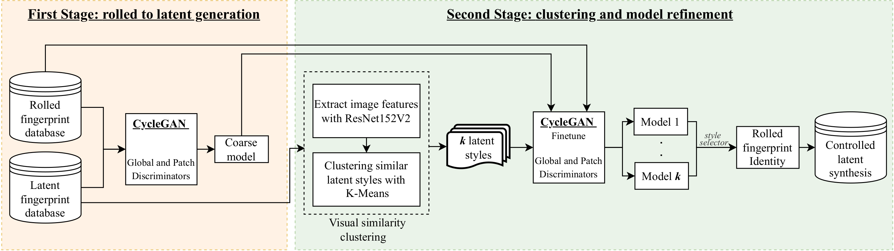

# Synthetic-Latent-Fingerprint-Generator

Given a full fingerprint image (rolled or slap), we present CycleGAN models to generate multiple latent impressions of the same identity as the full print. Our models can control the degree of distortion, noise, blurriness and occlusion in the generated latent print images to obtain Good, Bad and Ugly latent image categories as introduced in the NIST SD27 latent database. The contributions of our work are twofold: (i) demonstrate the similarity of synthetically generated latent fingerprint images to crime scene latents in NIST SD27 and MSP databases as evaluated by the NIST NFIQ 2 quality measure and recognition accuracies obtained by a SOTA fingerprint matcher, and (ii) use of synthetic latents to augment small-size latent training databases in the public domain to improve the performance of DeepPrint, a SOTA fingerprint matcher designed for rolled to rolled fingerprint matching on three latent databases (NIST SD27, NIST SD302, and IIITD-SLF). As an example, with synthetic latent data augmentation, the Rank-1 retrieval performance of DeepPrint is improved from 15.50\% to 29.07\% on challenging NIST SD27 latent database. Our approach for generating synthetic latent fingerprints can be used to improve the recognition performance of any latent matcher and its individual components (e.g., enhancement, segmentation and feature extraction).

Steps to create synthetic latent fingerprints using the proposed approach:



For further details refer to our WACV 2023 paper, https://arxiv.org/abs/2208.13811


## Citation

```
@misc{https://doi.org/10.48550/arxiv.2208.13811,
  doi = {10.48550/ARXIV.2208.13811},
  
  url = {https://arxiv.org/abs/2208.13811},
  
  author = {Wyzykowski, Andre Brasil Vieira and Jain, Anil K.},
  
  keywords = {Computer Vision and Pattern Recognition (cs.CV), FOS: Computer and information sciences, FOS: Computer and information sciences},
  
  title = {Synthetic Latent Fingerprint Generator},
  
  publisher = {arXiv},
  
  year = {2022},
  
  copyright = {arXiv.org perpetual, non-exclusive license}
}
```
